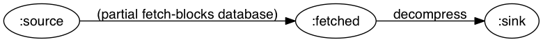

# Flowgraph

**Flowgraph** is a Clojure library for fast, concurrent, asynchronous data processing using directed graphs. Flowgraph supports cyclic graphs. Though it is not distributed, it does have primitive tools for minimizing communication overhead in the event that some processing steps involve calls to distributed resources. You can also easily prioritize some edges over others, or even prioritize the processing of some data based on any characteristic you choose.

If Flowgraph does not suit your needs, other good libraries that solve similar problems include [core.async](https://github.com/clojure/core.async), [plumatic/plumbing](https://github.com/plumatic/plumbing), and [Onyx](https://github.com/onyx-platform/onyx).

When you submit data to a flowgraph graph, a [tesserae](https://github.com/Workiva/tesserae) is returned. Revoking this tesserae before it is fulfilled will cause the task to be skipped and, if the graph is currently processing that job, an attempt will be made [to interrupt the threads and short-circuit execution](test/flowgraph/revoke_test.clj).

## A Trivial Example

In Flowgraph' graph model, every node represents a queue; every edge specification represents some kind of operation that moves data from queue to queue, possibly transforming the data along the way. Every graph begins with a `:source` and ends with a `:sink`:

```clj
(dc/deflow trivial-example
  [some-transformation]
  {:source {:type :transform
            :function some-transformation
            :destination :sink
            :coordinated? true}})
```
	            
This is almost the simplest graph possible in Flowgraph. It creates a function, `trivial-example`, which writes and then compiles the flow graph illustrated below. The edge represents the data transformation encapsulated in `some-transformation`, which is dynamically passed in as an argument to `trivial-example`. The `:coordinated?` flag ensures that no items are re-ordered as they traverse the edge from `:source` to `:sink`.


 Using the graph is easy:

```clj
> (def trivial-graph (trivial-example inc))
;; #'user/trivial-graph
> @(submit trivial-graph (range 10))
;; (1 2 3 4 5 6 7 8 9 10)
```

Flowgraph provides a few sugar functions to make large graphs less tedious. For instance, here is the same graph defined another way:

```clj
(dc/deflow trivial-example
  [some-transformation]
  {:source (dc/transform some-transformation
                         :sink :coordinated? true)})
```

## Edge Specs

There are five primitive edge types available in Flowgraph: `transform`, `discriminate`, `duplicate`, `fuse`, and `commix`. I call these edge types, but onle one (`transform`) represents a single edge; the other four each represent multiple edges. Part of the motivation for this is that, to enforce consistency, Flowgraph allows no two edge specs to pull data out of the same queue. Instead you explicitly specify multiple co-originating edges using `discriminate` and `duplicate`.

Because of this design choice, you provide all edge specifications to Flowgraph in the form of a map from edge to specification (or from edges to specification, in the case of `fuse` and `commix`). Thus you do not need to specify the origination point of an edge within the spec itself:

```clj
{ :node-a the-edge-spec-for-node-a,
  [:node-b :node-c] the-edge-spec-for-nodes-b-and-c,
  ... }
```

### transform

 style    | signature
--------- | ---------
 function | `(transform f destination & flags)`
 map      | `{ :type :transform, & :keys [ :function, :destination ... ] }`

This is the most straightforward. It represents a one to one edge that transforms data by passing it through a function `f`. This accepts the following optional flags (explained later):

`:batching?`, `:collecting?`, `:asynchronous?`, `:coordinated?`, `:priority`

### discriminate

 style    | signature
--------- | ---------
 function | `(discriminate predicate result->destination & flags)`
 map      | `{ :type :discriminate, & :keys [ :predicate, :result->destination ... ] }`

This is a one to many spec that moves data from a queue into one of several queues, determined by calling a predicate on each piece of data. `result->destination` should contain a key for every possible output of `predicate`; its values should be keywords representing nodes in the graph. This accepts the following optional flags (explained below):

  `:coordinated?`, `:priority`
  
### duplicate

 style    | signature
--------- | ---------
 function | `(duplicate destinations & flags)`
 map      | `{ :type :duplicate, & :keys [ :destinations ... ] }`
 
 `duplicate` is a one to many spec that duplicates data along every outgoing edge.  Accepts the following optional flags (explained below):
 
 `:coordinated?`, `:priority`
 
### fuse
 
 style    | signature
--------- | ---------
 function | `(fuse destination & flags)`
 map      | `{ :type :fuse, & :keys [ :destination ... ] }`
 
 A many to one spec that combines data from multiple sources. It places into the destination queue a single vector containing the outputs of all the input queues. Note that no data propagates along any of these edges until all of the input queues are ready to deliver an item. This means, among other things, that `fuse` always behaves as though the `:coordinated?` flag is true. Accepts the following optional flags (explained below):

`:priority`

### commix

 style    | signature
--------- | ---------
 function | `(commix destination & flags)`
 map      | `{ :type :commix, & :keys [ :destination ... ] }`

This is a many to one spec that merges data flow; i.e., all of the edges simply transfer data from their respective originating queues into the destination queue, without any kind of transformation. Accepts the following optional flags (explained below):

`:coordinated?`, `:priority`

## Optional Edge Flags

 flag | values | default | explanation
 ---- | ------ | ------- | -----------
 `:batching?` | `false`, *Long* | `false` | This can only be truthy on transformation edges. When this is not `false`, computation on this edge is postponed (if possible) until the originating queue has exactly that many items available for processing. Then the edge computes all of that data in one single batch. Thus the supplied tranformation function must be written to accept a sequence of inputs and to return a sequence of corresponding outputs (e.g., `#(map f %)` rather than `f`). Notā bene: because no expection is made that the cardinality of the input and output sequences are the same, this flag can be used for tricks like "unrolling" a single datum into several.
 `:collecting?` | `false`, *Long*, *IFn* | `false` | This can only be truthy on transformation edges. When this is set to a number, computation on this edge is postponed (if possible) until the originating queue has exactly that many items available for processing. Then the edge produces a single value from that sequence of inputs. Thus the supplied transformation function must be written to accept a sequence of inputs and to return a single output. If, instead, this flag is set to a function, computation on this edge is postponed (if possible) until `(function latest-addition last-addition)` for items on the originating queue returns `true`. Note that `:collecting?` and `:batching?` are mutually exclusive.
 `:asynchronous?` | *Boolean* | `false` | This can only be `true` on transformation edges. When `true`, the supplied transforming function is called in a future, freeing up the graph's thread pool to continue working. Designed to be used for I/O.
 `:timeout-ms` | *Long* | N/A | Ignored unless `:asynchronous?` is `true`; if the asynchronous call takes longer than value specified, the graph will cease processing the current submission and the corresponding promise will throw a detailed timeout error when dereferenced. There is no timeout by default.
 `:coordinated?` | *Boolean* | `false` | When this is `true`, the input and output on this individual edge are guaranteed to have the same ordering. When `false`, data may get out of order.
 `:priority` | *Long* | 1 | Determines the priority the edge receives as computation proceeds. Default priority is 1. If two edges both have work backed up on them, the one with a higher priority is chosen first.
 
## Node Specs

All nodes represent queues, and there is only a single flag to set for any node, so it is only necessary to declare node specifications if you want some node to be a priority-queue. In the various graph constructors, the node-specs are an optional argument, and they look like this:

```clj
{:node-name { :priority-queue? some-comparator } 
 ... }
```

The default value is simply `false`.

## More Complex Examples

```clj
(dc/deflow naive-pmapper
  [f]
  {:source (dc/transform #(apply f %) :sink
                         :coordinated? true)})
                         
(defn naive-pmap [f & cs] @(submit (naive-pmapper f) (apply map list cs)))
```

---
***



```clj
(dc/deflow read-blocks
  [database]
  {:source (dc/transform (partial fetch-blocks database) :fetched
                         :asynchronous? true,
                         :timeout-ms 10000,
                         :batching? 10)
   :fetched (dc/transform decompress :sink)})
```


---
***


```clj 
(dc/deflow render-results
  [database]
  {:source (dc/discriminate recent? {true :fresh, false :stale})
   :fresh (dc/transform compile-view :sink)
   :stale (dc/transform (partial refresh database) :fresh
                        :asynchronous? true
                        :priority 2)})
```

# Maintainers and Contributors

## Active Maintainers

-

## Previous Contributors

- Timothy Dean <galdre@gmail.com>
- Aleksandr Furmanov <aleksandr.furmanov@workiva.com>
